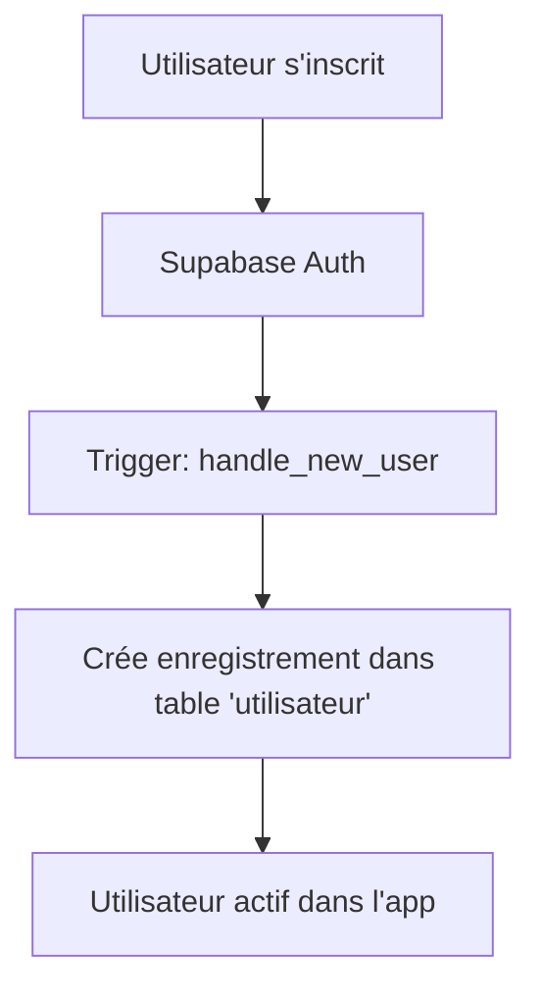

# Architecture et Structure Supabase - ParkSmart

## Présentation générale

ParkSmart utilise Supabase comme backend pour gérer:
- **Authentification** - Inscription, connexion, gestion des utilisateurs
- **Stockage de données** - Tables pour parkings, réservations, véhicules, etc.
- **Synchronisation** - Les deux applications (mobile + web) partagent la même base

---

## Schéma de base de données

### Tables principales

#### 1. **utilisateur**
Enregistrements des utilisateurs du système
```sql
- id (uuid) - Référence à auth.users, clé primaire
- nom (text) - Nom de l'utilisateur
- prenom (text) - Prénom de l'utilisateur
- email (text) - Email unique
- telephone (text) - Numéro de téléphone
- is_admin (boolean) - Statut administrateur
- created_at (timestamptz) - Date de création
```

**Fonctionnalités spéciales:**
- Trigger automatique lors de l'inscription (fonction `handle_new_user()`)
- Fonction `is_admin()` pour vérifier les droits admin

#### 2. **parking**
Information sur les parkings disponibles
```sql
- id (uuid) - Clé primaire
- nom (text) - Nom du parking
- adresse (text) - Adresse physique
- latitude (double) - Coordonnée GPS
- longitude (double) - Coordonnée GPS
- ville (text) - Ville (ex: Antananarivo)
- description (text) - Description du parking
- created_at (timestamptz) - Date d'ajout
```

#### 3. **place_parking**
Places individuelles dans un parking
```sql
- id (uuid) - Clé primaire
- parking_id (uuid) - Référence au parking
- numero (text) - Numéro/ID de la place
- occupe (boolean) - État d'occupation
- niveau (text) - Niveau (RDC, 1er étage, etc.)
```

#### 4. **tarif**
Tarification par parking
```sql
- id (uuid) - Clé primaire
- parking_id (uuid) - Référence au parking
- prix_heure (numeric) - Prix par heure
- prix_jour (numeric) - Prix par jour
```

#### Tables supplémentaires
- **vehicule** - Véhicules de l'utilisateur
- **reservation** - Réservations de places
- **paiement** - Transactions/paiements
- **avis** - Avis et notes des utilisateurs
- **notification** - Système de notifications

---

## Authentification

### Flux d'inscription



### Rôles et permissions

| Rôle | Permissions | Gestion |
|------|-----------|--------|
| **User** (par défaut) | Voir parkings, réserver, payer | Mobile + Web |
| **Admin** (is_admin=true) | Gérer parkings, tarifs, utilisateurs | Web admin seulement |

### Configuration sur Supabase

**Row Level Security (RLS)** - À configurer:
```sql
-- Utilisateurs peuvent voir leur propre profil
ALTER TABLE utilisateur ENABLE ROW LEVEL SECURITY;

-- Admins peuvent tout voir
CREATE POLICY "admin_all_access" ON utilisateur
  FOR ALL USING (is_admin());

-- Users voient uniquement leur profil
CREATE POLICY "user_own_profile" ON utilisateur
  FOR SELECT USING (auth.uid() = id);
```

---

## Applications

### Mobile (Flutter)
- **Plateforme**: Android/iOS via Flutter
- **URL Supabase**: `https://knzoqcvlxmgsxgooizuk.supabase.co`
- **Configuration**: Via `--dart-define` ou `.env`
- **Fonctionnalités**: 
  - Recherche de parkings
  - Réservation de places
  - Paiement
  - QR code
  - Localisation GPS

### Web Admin (React)
- **Plateforme**: React avec Vite
- **URL Supabase**: Identique au mobile (même base)
- **Configuration**: Via `.env` avec variables `VITE_*`
- **Fonctionnalités**:
  - Gestion des parkings
  - Gestion des tarifs
  - Gestion des utilisateurs
  - Statistiques

---

## Configuration côté client

### 1. Flutter (Mobile)

**Initialisation dans `lib/main.dart`:**
```dart
await Supabase.initialize(
  url: supabaseUrl,
  anonKey: supabaseKey,
);
```

**Variables d'environnement lors du build:**
```bash
flutter build apk --release \
  --dart-define=SUPABASE_URL=https://knzoqcvlxmgsxgooizuk.supabase.co \
  --dart-define=SUPABASE_ANON_KEY=<YOUR_ANON_KEY>
```

### 2. React (Web Admin)

**Initialisation dans `admin-web/src/config/supabase.js`:**
```javascript
export const supabase = createClient(SUPABASE_URL, SUPABASE_ANON_KEY);
```

**Variables d'environnement via `.env`:**
```env
VITE_SUPABASE_URL=https://knzoqcvlxmgsxgooizuk.supabase.co
VITE_SUPABASE_ANON_KEY=<YOUR_ANON_KEY>
```

---

## Bonnes pratiques et sécurité

### ✅ À faire

1. **Utiliser les fonctions Supabase** pour les opérations sensibles
2. **Configurer RLS** sur toutes les tables
3. **Utiliser des variables d'environnement** pour les clés
4. **Valider côté serveur** via Functions Supabase
5. **Auditer** les accès aux données

### ❌ À ne pas faire

1. ❌ Ne **pas** hardcoder les clés dans le code source
2. ❌ Ne **pas** exposer la clé de service (service_role_key)
3. ❌ Ne **pas** faire confiance aux validations côté client seules
4. ❌ Ne **pas** ignorer les erreurs d'authentification

---

## Ressources

- [Docs Supabase](https://supabase.com/docs)
- [Supabase Flutter Plugin](https://pub.dev/packages/supabase_flutter)
- [Supabase JS Client](https://www.npmjs.com/package/@supabase/supabase-js)
- Fichier SQL complet: `supabase_schema.sql`
